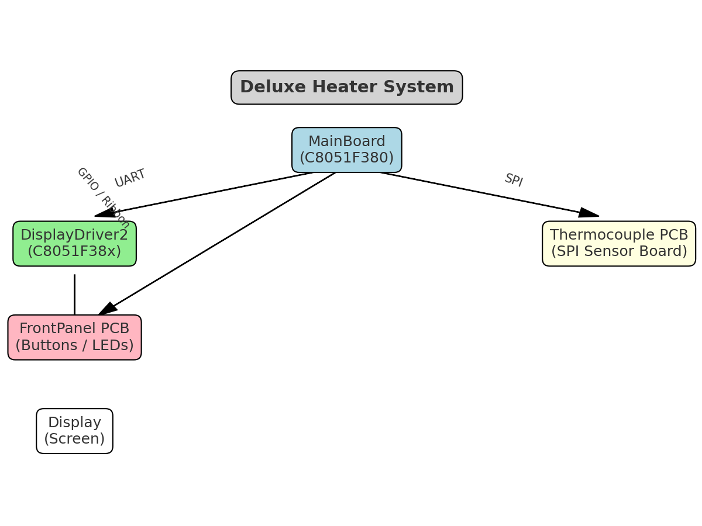

# 👋 Welcome to my GitHub

I’m Jack Walton. These are my projects for the **Deluxe Heater** system.

---

## 🔹 System Block Diagram

**Connections**
- **MainBoard (C8051F380)** ↔ **DisplayDriver2 (C8051F38x)** via **UART**
- **MainBoard (C8051F380)** ↔ **Thermocouple PCB** via **SPI**
- **MainBoard (C8051F380)** ↔ **FrontPanel PCB** via **GPIO/Ribbon**
- **DisplayDriver2** ↔ **Display** (screen interface)

---

## 🔹 Projects

### Firmware
- [**DeluxeHeater**](https://github.com/jwalton49/DeluxeHeater)  
  Main control firmware (current tag: w-DeluxeHeater-v8.40)
- [**DisplayDriver2**](https://github.com/jwalton49/DisplayDriver2)  
  Display firmware running on a C8051F38x

### Hardware (Altium Designer 20.2.7)
- [**MainBoardPCB**](https://github.com/jwalton49/MainBoardPCB) – central controller PCB  
- [**FrontPanelPCB**](https://github.com/jwalton49/FrontPanelPCB) – user interface PCB  
- [**ThermocouplePCB**](https://github.com/jwalton49/ThermocouplePCB) – sensor interface PCB

---

## 🔹 Release Conventions
- **Firmware tags:** w-<project>-vX.Y.Z  
  Example: w-DeluxeHeater-v8.40
- **PCB tags:** pcb-<board>-R<rev>  
  Example: pcb-MainBoard-R1.2

---

## 🔹 Toolchains & CAD
- Firmware: **Keil µVision 5.x**, **Simplicity Studio 5/6 (8051 support)**  
- Hardware: **Altium Designer 20.2.7**

---

✨ Thanks for visiting!
